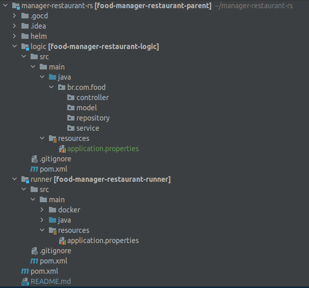
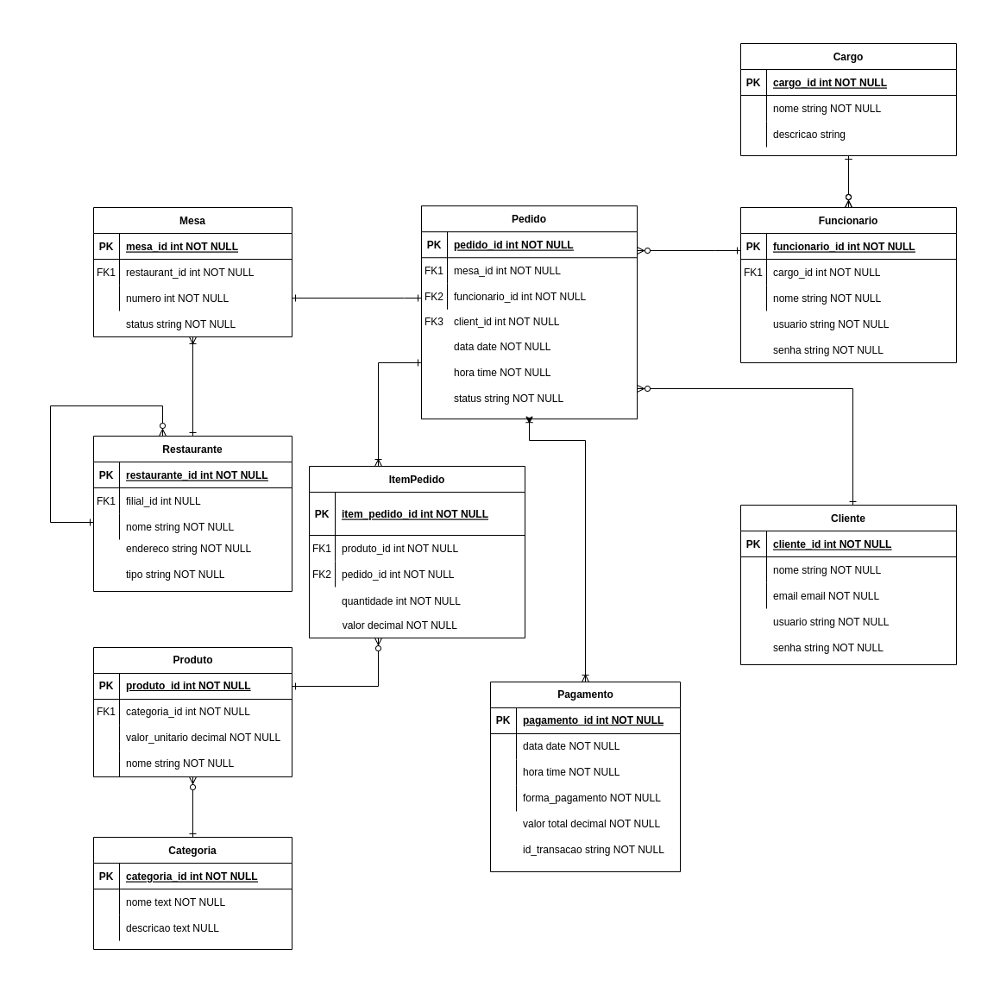

# Arquitetura Backend Java - Sistema de Operações de Restaurante

Este Documento descreve proposta para uma arquitetura de um sistema de operações de um restaurante

### Requisitos

<ul>
  <li>O sistema deve ser capaz de lidar com múltiplas filiais e mesas em cada filial</li>
  <li>Deve ser possível fazer pedidos de alimentos e bebidas através de uma interface de usuário</li>
  <li>Os garçons devem ter a capacidade de gerenciar pedidos e marcar os pedidos como concluídos</li>
  <li>Deve haver um sistema de pagamento que aceite diferentes formas de pagamento</li>
  <li>O sistema deve manter um registro de todos os pedidos e transações financeiras</li>
</ul>

### Definições

##### Crie um novo projeto Spring Boot

Será necessário criar um projeto java (manager-restaurant-rs) com suporte a Spring Boot. 

Para criar um novo projeto Spring Boot, visite *[Spring Initializr](https://start.spring.io/)*. e escolha as seguintes opções:

- Project: Maven
- Language: Java
- Packaging: Jar
- Java version: 11
- Spring Boot: 3.X

Dependências Adicionais

- **Spring Web** - Inclui implementações que permite disponibilizar serviço na web, incluindo o RestFull, e apache como container para disponibilizar os serviços
- **Spring Security** - Estrutura de autenticação e segurança para os serviços
- **Spring Data JPA** - Suporte ao mapeamento objeto relacional com o banco de dados utilizado
- **Spring Boot Actuator** - Suporte ao enpoints que permitem verificar a "saúde" do serviço, alem de métricas e sessões
- **Lombok** - Biblioteca de anotação Java que ajuda a reduzir o código padrão

Esse projeto contém a seguinte estrutura:

###### Módulos:

- **logic**: módulo para implementação de classes de negócio.
- **runner**: módulo para configuração e start da aplicação. Possui a classe `Application.java`
  que configura e inicia a aplicação por meio de Spring Boot. Possui também pasta **docker** com
  definições para geração da imagem Docker.

###### Outros:

- **.gocd**: pasta com configurações de build e deploy no GO CD.
- **helm**: arquivos helm chart de configurações para deploy no Kubernetes.
- **health check**: por default, é utilizado Spring Actuator para disponibilização
  de health check. A url é `/${serviceName}/actuator/health`



### Banco de Dados

Para definição do banco de dados, optamos por um modelo relacional, visto que, as entidades filiais, mesas, alimentos, bebidas, pedidos, pagamentos e garcom. 
Podem ser representadas e persistidas em tabelas e os devidos relacionamentos como: filiais de um restaurante, garçom do pedido, e etc...
podem ser representados por chaves estrangeira ou relacionamentos entre entidades ou tabelas.

Segue o modelo de definição de dados proposto:



### API e Microsserviços

  - Serviço de atutenticação para cliente e funcionarios, o sistema deverá ter controle de acesso de acordo com o perfil logado.
  - Serviço de Alimentos e Bebidas disponiveis agrupados por categoria, para fazer o pedido (Cardápio).
  - A API irá disponibilizar operações sobre gerenciamento de pedido (Fazer/Alterar pedido, Alterar status e Fechar Pedido)
  - A autenticação do sistema será usando usuario e senha, com a api do spring security irá gerar um token de autenticação para ter acesso ao sistema.
    - Tela inicial será login, para autenticação do sistema.
    - Demais telas precisa de token de autenticação, caso não tenha token valido, será redirecionado para tela de login.
  - Para notificação podemos usar uma configuração de webhooks, sobre a tela de lista de pedidos, sendo assim, qualquer alteração no pedido, o garçom será notificado e acompanhar na listagem.

### Gestão de Pedidos e Mesas

1. Ao acessar o sistema, irá mostrar uma opção dos restaurantes, após a seleção, entra no espaço de operações do restaurante selecionado
2. O cliente poderá selecionar os itens do pedido, como alimentos e bebidas, com devidas observações e adicionais.
   1. Caso o cliente faça o pedido fica com STATUS (ABERTO)
   2. O cliente poderá acompanhar o pedido
3. O Garçom poderá fazer, alterar o pedido
   1. Caso esteja aceitando os pedidos ABERTO, deve selecionar a mesa no sistema, confirmar os itens do pedido e enviar o pedido para cozinha, com status (EM_PREPARO) 
   2. O garçon poderá fazer o pedido, selecionando a mesa disponível, itens do pedido (alimentos e bebidas, com devidas observações e adicionais) e enviando para cozinha, com status (EM_PREPARO)
4. Ao fim do preparo o pedido altera o status para (PRONTO), disponível para o garçom servir.
5. A mesas tem o status de (DISPONIVEL, SOLICILAR_GARCON, EM_ATENDIMENTO, FECHAR_CONTA)
6. Quando o status da mesa for alterado o garçom sera notificado, para gerenciar o pedido.
7. O Garçom altera o status da mesa e assim que a mesa solicitar o fechamento da conta, inicia o processo de pagamento.

### Sistema de Pagamento

1.  O sistema deve ter uma tela de pagamento com opção de seleção forma de pagamento (DINHEIRO, DEBITO, CREDITO)
   1. Caso seja em especie, selecionar a forma de pagamento e fechar a pedido.
   2. Caso seja cartão, alem da forma de pagamento, registra o id_transação e token gerado no momento do pagamento.
      1. Caso o sistema estaja integrado com a maquina de cartão, capturar id_transação e token via web service da operadora de cartão.
2.  Apos registro do pagamemento, o pedido é CONCLUIDO e o status da mesa, fica DISPONIVEL

### Escalabilidade e Redundância

1.  O sistema permite que o restaurante tenha multiplas filiais, no cadastro do restaurante temos a opção TIPO (SEDE, FILIAL)
   1. Caso seja sede o restaurante pode ou não ter varias filiais e caso seja filial sempre estará associada ao um restaurante tipo SEDE.
2.  Um Restarante tem varias mesas, no sistema, portanto, no fluxo de acesso ao sistema a opção de seleção do restaurante é obrigatória, desta forma é exibido somente as mesas do restaurante selecionado para operações de pedido. 
3.  Como sugestão de escalabilidade o sistema pode ser implatado em ambiente dockerizado e orquestrado pelo kubernate, automatizar o processo de implantação.
   1. Criar pipeline de implantação (compilação, testes, imagem, sonar e deploy)
   2. Paramentrizar no projeto o helm da aplicação, contendo os limites da replica e propriedades como CPU e Memoria com os parametro min e max.

### Segurança

Para dectatar possiveis vulneráveis do sistema, podemos usar bibliotecas open-source que fazer o scanner desde o processo de desenvolvimento, assim identificado falhas de segurança o mais rapido possivel.
Uma sugestão seria utilizar o Snyk versao gratuita. O Snyk é uma ferramenta que automatiza o processo de detecção e correção de vulnerabilidades nas dependências de uma aplicação.
Com possibilidade de integrar com ferramentas de CI/CD e com o repositorio como GitHub, Bitbucket e GitLab. 

Sendo assim podemos adicionar a dependencia ao pom.xml do projeto e monitora o build da aplicação possiveis falhas, como: vulnerábilidade de bibliotecas de terceiros, SQL Injection, Criptográficas, Componentes vulneráveis e desatualizados, autenticação e autorização entre outras.

### Considerações Gerais

 - Considerar os principios de boas praticas de desenvolvimento de código, baseado no SOLID e Clean Code. 
 - Propriedades do banco de dados em sistema registry service, desta forma as credencias do banco não ficará exposta.

   ```
   spring.datasource.url=${DATASOURCE_URL}
   spring.datasource.username=${DATASOURCE_USERNAME}
   spring.datasource.password=${DATASOURCE_PASSWORD}

 - Padronizar variaveis de ambiente da aplicação externas ao projeto
